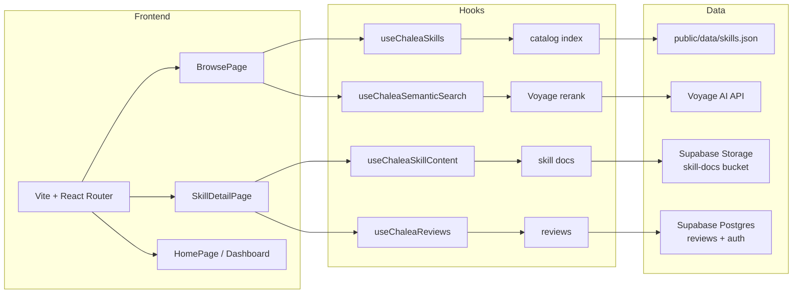
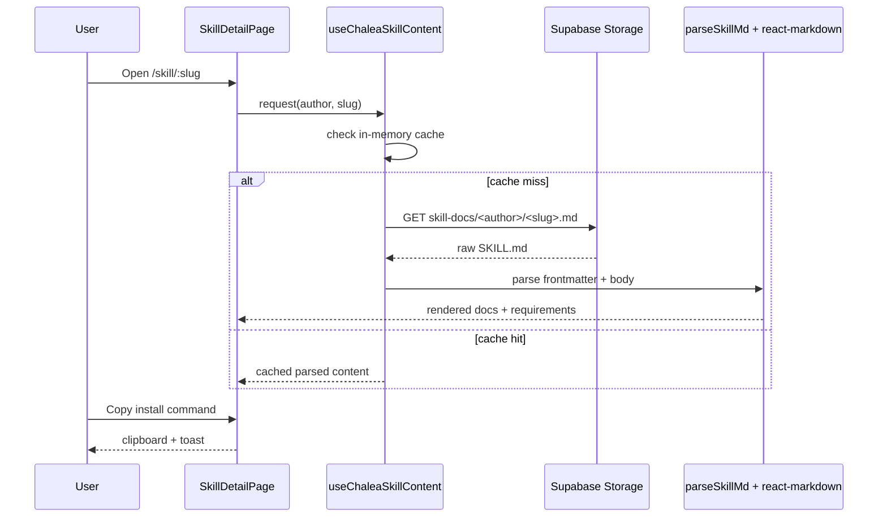
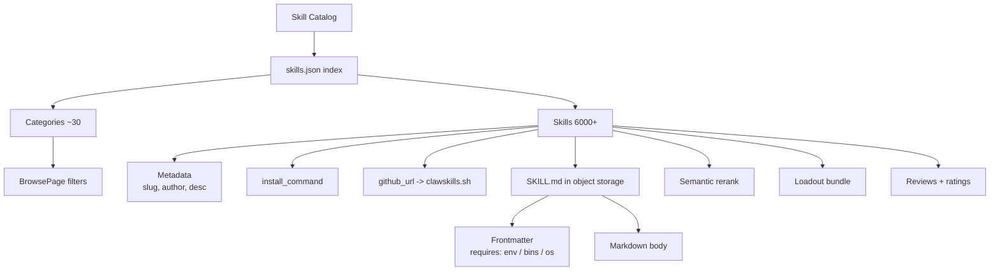

# Chalea Clawskill


**The front door to the OpenClaw skill ecosystem.**

[](https://github.com/spooky-may/chaleaclawskill-k3)

<!-- X handle: swap href when the account is live -->
<a href="https://x.com/" target="_blank"><svg xmlns="http://www.w3.org/2000/svg" viewBox="0 0 24 24" width="24" height="24" fill="currentColor"><path d="M18.244 2.25h3.308l-7.227 8.26 8.502 11.24H16.17l-5.214-6.817L4.99 21.75H1.68l7.73-8.835L1.254 2.25H8.08l4.713 6.231zm-1.161 17.52h1.833L7.084 4.126H5.117z"/></svg></a>
<a href="https://github.com/spooky-may/chaleaclawskill-k3" target="_blank"><svg xmlns="http://www.w3.org/2000/svg" viewBox="0 0 24 24" width="24" height="24" fill="currentColor"><path d="M12 0c-6.626 0-12 5.373-12 12 0 5.302 3.438 9.8 8.207 11.387.599.111.793-.261.793-.577v-2.234c-3.338.726-4.033-1.416-4.033-1.416-.546-1.387-1.333-1.756-1.333-1.756-1.089-.745.083-.729.083-.729 1.205.084 1.839 1.237 1.839 1.237 1.07 1.834 2.807 1.304 3.492.997.107-.775.418-1.305.762-1.604-2.665-.305-5.467-1.334-5.467-5.931 0-1.311.469-2.381 1.236-3.221-.124-.303-.535-1.524.117-3.176 0 0 1.008-.322 3.301 1.23.957-.266 1.983-.399 3.003-.404 1.02.005 2.047.138 3.006.404 2.291-1.552 3.297-1.23 3.297-1.23.653 1.653.242 2.874.118 3.176.77.84 1.235 1.911 1.235 3.221 0 4.609-2.807 5.624-5.479 5.921.43.372.823 1.102.823 2.222v3.293c0 .319.192.694.801.576 4.765-1.589 8.199-6.086 8.199-11.386 0-6.627-5.373-12-12-12z"/></svg></a>

Browse 6,000+ OpenClaw skills, preview their docs, bundle a loadout, and
install with one command — all from a single fast catalog.

---

## Contract Address

<!-- Paste the CA below when available -->

**CA:** _TBA_

---

## What it does

- **Index the whole catalog** — every published OpenClaw skill, searchable by name, category, and natural-language intent.
- **Preview before you install** — open any skill's `SKILL.md`, requirements, and install command without leaving the page.
- **Build a loadout** — pin the skills you actually use and copy every install command as one block.
- **Decide with signal** — community star ratings and notes surface what's worth the setup time.

---

## Key features

| Feature | Description |
|---|---|
| Semantic search | Voyage `rerank-2-lite` ranks results by intent, not just keyword match |
| One-click install | Copy `npx clawhub@latest install <slug>` from any card |
| Skill preview drawer | Side-drawer renders the upstream `SKILL.md` with requirements panel |
| Loadout bundles | Multi-select skills, export all install commands at once |
| Community reviews | Supabase-backed star ratings + notes, gated behind login |
| Lean deploy | Skill docs live in object storage; the app bundle stays small |

---

## Live demo

```
https://chaleaclawskill.site
```

Browse the catalog, toggle semantic search, open a skill drawer, build a
bundle. No account needed to browse — login only gates bookmarks + reviews.

---

## Architecture overview



---

## Data flow



---

## Catalog taxonomy



---

## Tech stack

| Layer | Technology |
|---|---|
| Frontend | Vite, React 18, TypeScript, React Router, Tailwind CSS |
| UI system | Custom glass/bento components, IBM Plex Sans + JetBrains Mono |
| Auth + data | Supabase (Postgres, Auth, Storage) |
| Semantic search | Voyage AI `rerank-2-lite` |
| Markdown | react-markdown + remark-gfm |
| Hosting | Vercel (static SPA), GitHub Actions CI |

---

## Installation

```bash
# 1. Clone the repository
git clone https://github.com/spooky-may/chaleaclawskill-k3
cd chaleaclawskill-k3

# 2. Install dependencies
pnpm install

# 3. Configure environment
cp .env.example .env.local   # fill Supabase + Voyage keys

# 4. Start the dev server
pnpm dev
```

Open `http://localhost:5173`. The catalog index loads from
`public/data/skills.json`; skill docs are fetched from the Supabase
Storage `skill-docs` bucket at runtime.

---

## Environment

| Variable | Purpose |
|---|---|
| `VITE_SUPABASE_URL` | Supabase project URL |
| `VITE_SUPABASE_ANON_KEY` | Supabase anon key (RLS-protected) |
| `VITE_VOYAGE_API_KEY` | Voyage AI key for semantic rerank |
| `VITE_OPENROUTER_API_KEY` | Optional — assistant features |

`.env.local` is gitignored. Set the same `VITE_*` vars in the Vercel
project for production builds.

---

## Project structure

```
src/
  components/   Chalea-prefixed UI primitives + composite views
  pages/        Route-level views (one per React Router path)
  hooks/        useChalea* — catalog, search, bookmarks, reviews, content
  context/      AuthContext, ToastContext
  lib/          Supabase client, types, markdown parsing
public/
  data/         skills.json + categories.json (catalog index)
  skills/       dev-only mirror (gitignored; prod fetches from Storage)
scripts/
  sync-skills.mjs              merge upstream catalog into the snapshot
  generate-sitemap.mjs         rebuild public/sitemap.xml
  upload-skills-to-supabase.mjs bulk-upload SKILL.md into Storage
```

---

## Contributing

See [CONTRIBUTING.md](./CONTRIBUTING.md). Architecture notes live in
[ARCHITECTURE.md](./ARCHITECTURE.md); release history in
[CHANGELOG.md](./CHANGELOG.md).

## License

MIT — see [LICENSE](./LICENSE).
